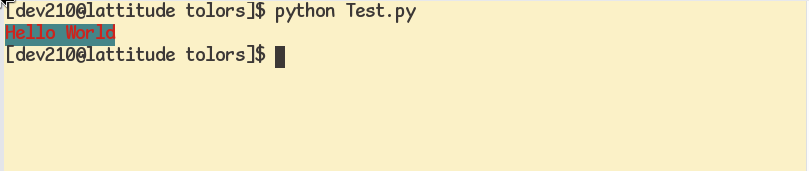

# tolors
A minimal library adding colors to terminal apps written in python

# TODOS:-

- Add bright colors

# Usage

```python
import tolors
tolors.tolorful_print(text="Hello World" , background=tolors.BLUEB , foreground=tolors.REDF)
```



# Note:-

Its not complete
